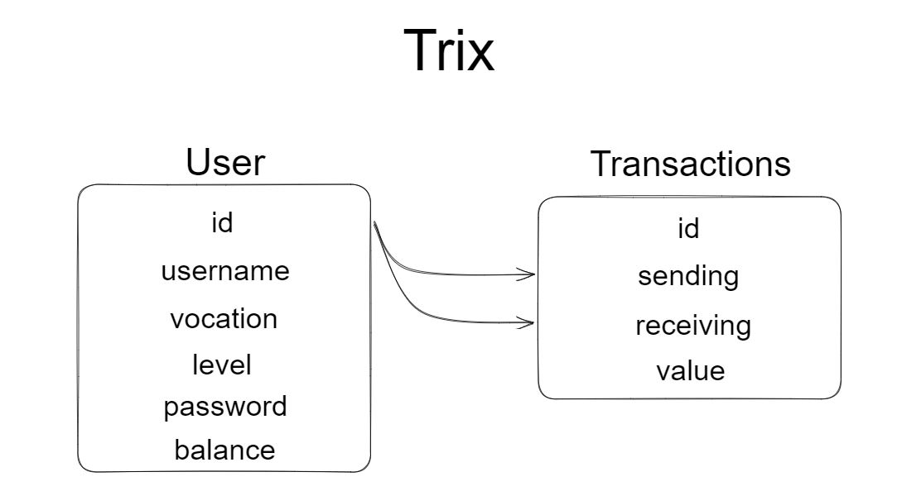

# Trix -  Seu App de Transferências

### dos mesmos criadores de um carro de 10s, aqui vai um projeto de 28 horas

# Contexto

Este projeto tem como objetivo demonstra as habilidades do autor com desenvolvimento backend.

Nesse projeto é utilizado Node.js,TypeScript, Express, Docker, MySql, Chai, Sinon, Swagger, Jest, Mocha, node-fetch, etc...

## Api Utilizada

Neste projeto é utilizada a API 'https://docs.awesomeapi.com.br/api-de-moedas' para requisição das cotações de moedas atualizadas a cada 30s

## End Points

  
<strong>/docs</strong>

   
   este end-point contém swagger documentado com objetivo de demonstrar habilidade na stack
    

  
<strong>/users</strong>

   
  <strong> post - cadastro de novo usuário:</strong> 
      username: string  
      vocation: string  
      level: number  
      password: string  
      balance: number  
    

  
<strong>/login</strong>

   
  <strong> post - login de usuários na plataforma:</strong> 
      username: string  
      password: string  
    

  
<strong>/transactions</strong>

   
  <strong> put - /transactions/deposit - deposito de dinheiro em conta:</strong> 
      money: number  
      token 
    
   <strong> put - /transactions/withdrawal - saque de dinheiro em conta:</strong> 
      money: number  
      token 
    
   <strong> post - /transactions/trix - transferencia bancária instantanea:</strong> 
      receiving: string  
      money: number  
      token 
    
    

  
<strong>/coin</strong>

   
   <strong> get - consulta a cotações atualizadas de moedas</strong> 
       parâmetros não são necessários 
     
    
   <strong> get - /coin/:code - consulta da cotação da moeda especificada pelo code(consulta api externa)</strong> 
       code: string 
     
    <strong> post - /coin/sellcoin - venda de moeda estrangeira e deposito automático em Real (R$)</strong> 
       code: string 
       username: string  
       money: number  
     

## Baixando Aplicação

1. Clone o repositório

2. Prepare o ambiente
  * Se local, instale as dependências:
    * `npm install`
  * Se utilizar docker, suba:
    * `docker-compose up -d` 
    * `docker exec -it trix bash`
    * `npm install`
3. Prepare o Banco
  * abra seu workbench e rode o arquivo  Trix.sql
4. Execute a aplicação
  * Inicialize o projeto:
    * `npm start` 
  * Verifique que os testes estão executando:
    * `npm test` 
    
## Modelo Relacional

  
